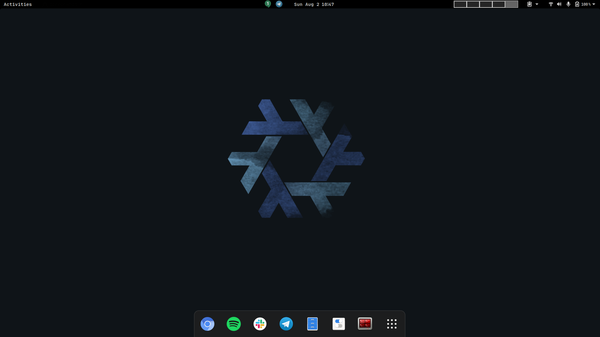
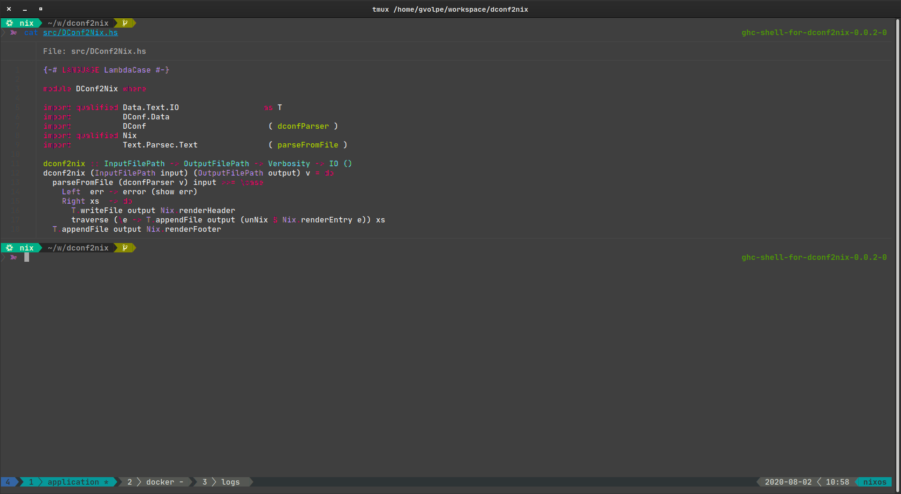

nix-config (gnome3 version)
===========================

This is more or less the same configuration I currently use, except it is adapted to use Gnome3 as the desktop environment. You can see a few screenshots below.

#### Fish Shell

I use a customized version of [bobthefish theme](https://github.com/oh-my-fish/theme-bobthefish). Here's a screenshot.

#### Gnome3

My desktop manager of choice, including a few extensions like `dash-to-dock`, `clipboard-indicator` and `sound-output-device-chooser`.

#### NeoVim

My favorite text editor and IDE powered by LSP (language server protocol). I use too many plugins to name so here's a screenshot taken while editing this file.

#### Terminator

A great terminal multiplexer, easy to use.

#### Tmux

Another terminal multiplexer, also capable of keeping SSH sessions alive.

