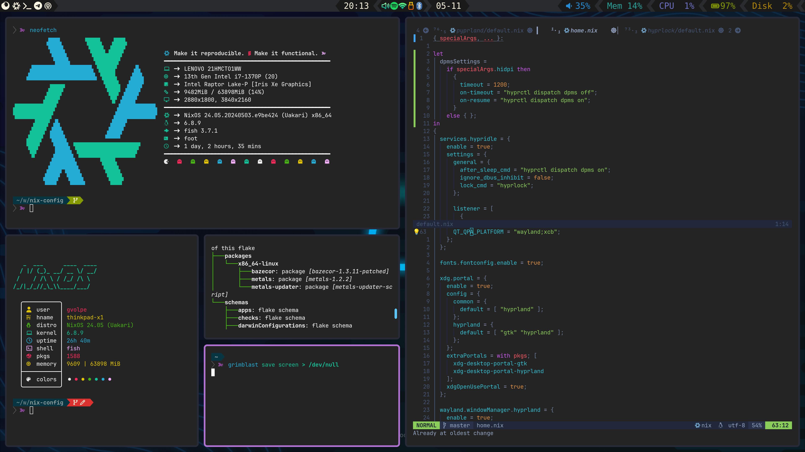
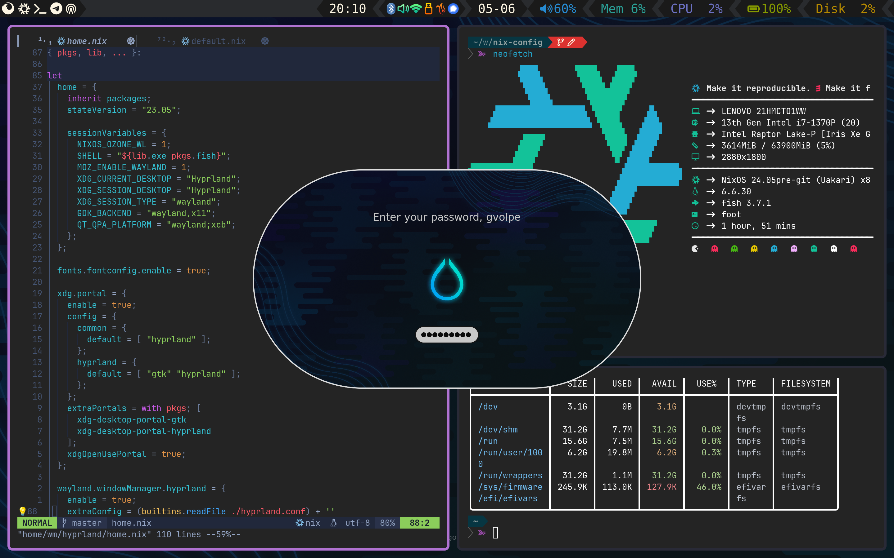
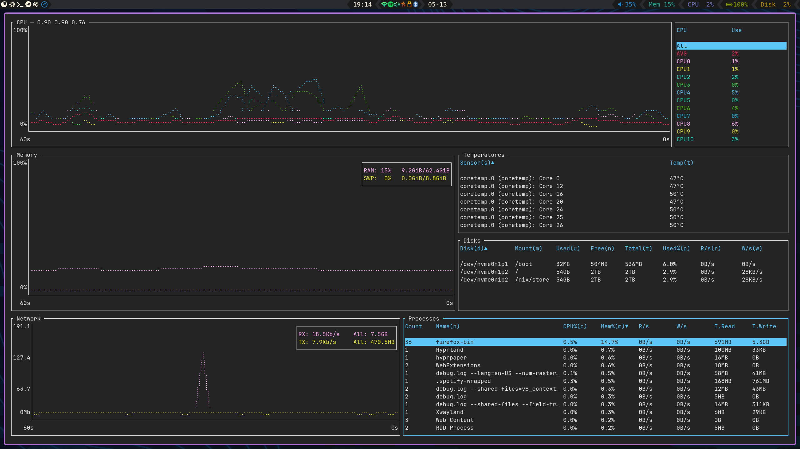
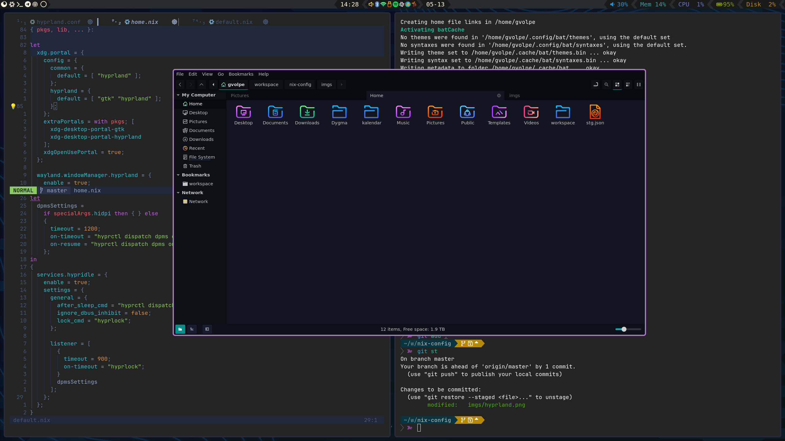
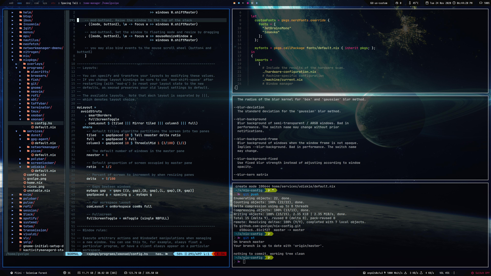
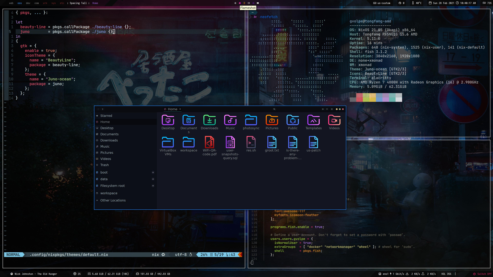

nix-config
==========


[](https://garnix.io)

My current — and always evolving — NixOS configuration files, home-manager, neovim, etc.

## Hyprland

This is my current Window Manager — the hype Wayland kid on the block!



<details>
<summary>Environment details</summary>

| Type           | Program      |
| :------------- | :----------: |
| Editor         | [NeoVim](https://neovim.io/) |
| Launcher       | [Wofi](https://sr.ht/~scoopta/wofi) |
| Shell          | [Fish](https://fishshell.com/) |
| Status Bar     | [Waybar](https://github.com/Alexays/Waybar) |
| Terminal       | [Foot](https://codeberg.org/dnkl/foot) |
| Window Manager | [Hyprland](https://hyprland.org/) |
| File Manager   | [Nemo](https://github.com/linuxmint/nemo) |
| GTK Theme      | [Juno Ocean](https://github.com/EliverLara/Juno) |
| GTK Icon Theme | [Beauty Line](https://www.gnome-look.org/p/1425426/) |
| Terminal Font  | [JetBrainsMono](https://www.jetbrains.com/lp/mono/) |

</details>

<details>
<summary>Expand to see more screenshots</summary>








</details>

## XMonad

XMonad will be forever in my heart — the best X window manager!


<details>
<summary>Environment details</summary>

| Type           | Program      |
| :------------- | :----------: |
| Editor         | [NeoVim](https://neovim.io/) |
| Launcher       | [Rofi](https://github.com/davatorium/rofi) |
| Shell          | [Fish](https://fishshell.com/) |
| Status Bar     | [Polybar](https://polybar.github.io/) |
| Terminal       | [Alacritty](https://github.com/alacritty/alacritty) |
| Window Manager | [XMonad](https://xmonad.org/) |
| File Manager   | [Nautilus](https://gitlab.gnome.org/GNOME/nautilus) |
| GTK Theme      | [Juno Ocean](https://github.com/EliverLara/Juno) |
| GTK Icon Theme | [Beauty Line](https://www.gnome-look.org/p/1425426/) |
| Terminal Font  | [JetBrainsMono](https://www.jetbrains.com/lp/mono/) |

</details>

<details>
<summary>Expand to see more screenshots</summary>







</details>

## NeoVim

My NeoVim configuration lives here: https://github.com/gvolpe/neovim-flake

## Structure

<details>
<summary>Overview of the project structure</summary>

```
.
├── flake.nix
├── flake.lock
├── switch
├── home
├── imgs
├── lib
├── notes
├── outputs
└── system
```

- `flake.nix`: home and system configurations.
- `switch`: helper script to build and switch home and system configurations.
- `home`: all the user programs, services and dotfiles for different window managers.
- `imgs`: screenshots and other images.
- `lib`: custom nix library functions and overlays used to instantiate pkgs.
- `notes`: cheat-sheets, docs, etc.
- `outputs`: the Home Manager and NixOS flake outputs.
- `system`: the NixOS configuration, settings for different laptops and window managers.

</details>

## Flake outputs

You can have a look at the available flake outputs before getting started.

```console
$ nix flake show github:gvolpe/nix-config
├───apps
│   └───x86_64-linux
│       └───nix: app
├───homeConfigurations
│   ├───hyprland-edp: home-manager configuration [home-manager-generation]
│   ├───hyprland-hdmi: home-manager configuration [home-manager-generation]
│   ├───xmonad-edp: home-manager configuration [home-manager-generation]
│   └───xmonad-hdmi: home-manager configuration [home-manager-generation]
├───nixosConfigurations
│   ├───dell-xps: NixOS configuration [nixos-system-dell-xps-15-9560-24.05pre-git]
│   ├───thinkpad: NixOS configuration [nixos-system-thinkpad-x1-24.05pre-git]
│   └───tongfang-amd: NixOS configuration [nixos-system-tongfang-amd-24.05pre-git]
├───out
│   ├───overlays: custom instance to be used by consumers of this flake
│   └───pkgs: custom instance to be used by consumers of this flake
└───packages
    └───x86_64-linux
        ├───bazecor: package [bazecor-1.3.11-patched]
        ├───metals: package [metals-1.2.2]
        └───metals-updater: package [metals-updater-script]
```

As well as all the declared flake inputs.

```console
nix flake metadata github:gvolpe/nix-config
```

### Install

The `edp-tongfang-amd` configuration also contains my Home Manager configuration using the NixOS module, so it can easily be tested with a single command.

```console
nixos-rebuild switch --flake github:gvolpe/nix-config#edp-tongfang-amd
```

Or you can test it directly on a QEMU virtual machine, though it has its limitations in terms of graphics.

```console
nixos-rebuild build-vm --flake github:gvolpe/nix-config#edp-tongfang-amd
./result/bin/run-tongfang-amd-vm
```

Having both NixOS and Home Manager configurations combined makes it easier to quickly install it on a new machine, but my preference is to have both separate, as my Home Manager configuration changes more often than that of the NixOS one, resulting in multiple generations at boot time.

Managing the different Home Manager generations in isolation makes this way easier for me.

### NixOS

The NixOS configuration can be installed by running the following command.

```console
nixos-rebuild switch --flake github:gvolpe/nix-config#tongfang-amd
```

Beware that the `hardware-configuration.nix` file is the result of the hardware scan of the specific machine and might not be suitable for yours.

### Home Manager

A fresh install requires the creation of certain directories (see what the `switch` script does). However, if you omit those steps, the entire HM configuration can also be built as any other flake.

```console
nix build github:gvolpe/nix-config#homeConfigurations.xmonad-edp.activationPackage
result/activate
```

### Fresh install

To set up a new machine from scratch, have a look at [this document](./notes/new-machine.md).
