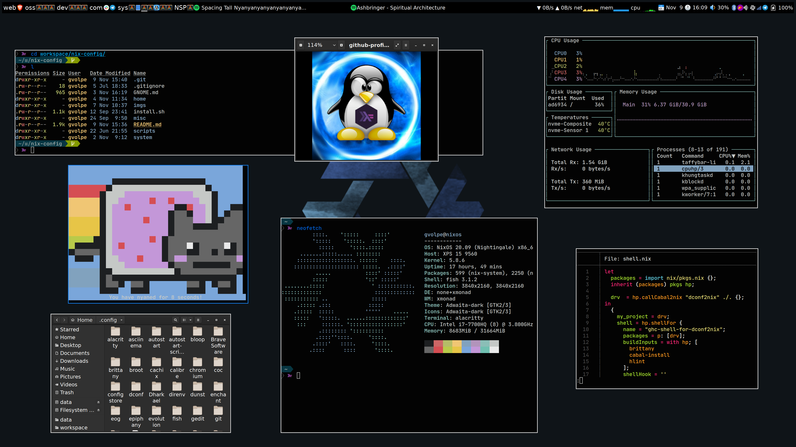

nix-config
==========

My current - and always evolving - NixOS configuration files, home-manager, neovim, etc.

## Structure

Here is an overview of the folders' structure:

```
├── home
│   ├── home.nix
│   ├── overlays
│   ├── programs
│   └── services
├── imgs
├── install.sh
├── misc
├── scripts
└── system
    ├── configuration.nix
    └── machine
    └── wm
```

- `home`: all the user programs, services and dotfiles.
- `imgs`: screenshots and other images.
- `install.sh`: the install script.
- `misc`: cheat-sheets, docs and useful commands.
- `scripts`: a few scripts I find useful.
- `system`: the NixOS configuration, settings for different laptops and window managers.

## Programs

The `home.nix` file contains details about all the software I use but here's a shout-out to the ones I use the most and that are customized to my needs.

### XMonad

A customizable Window Manager, combined with `taffybar` as the status bar and `rofi` as the application launcher.




### More

- [Alacritty](https://github.com/alacritty/alacritty): My default terminal emulator.
- [Fish Shell](https://fishshell.com/): I use a customized version of [bobthefish theme](https://github.com/oh-my-fish/theme-bobthefish).
- [NeoVim](https://neovim.io/): My all-time favorite text editor and IDE, powered by the Language Server Protocol.

## Install

On a fresh NixOS installation, run the following commands:

```shell
mkdir DELETE_ME && cd DELETE_ME
nix-shell --run \
  "wget -c https://github.com/gvolpe/nix-config/archive/master.tar.gz && tar --strip-components=1 -xvf master.tar.gz" \
  -p wget s-tar
chmod +x install.sh && ./install.sh
```

## Gnome3 (previous config)

I've been using Gnome3 for a while before switching to XMonad. Have a look at [Gnome3](./GNOME.md) for more.
