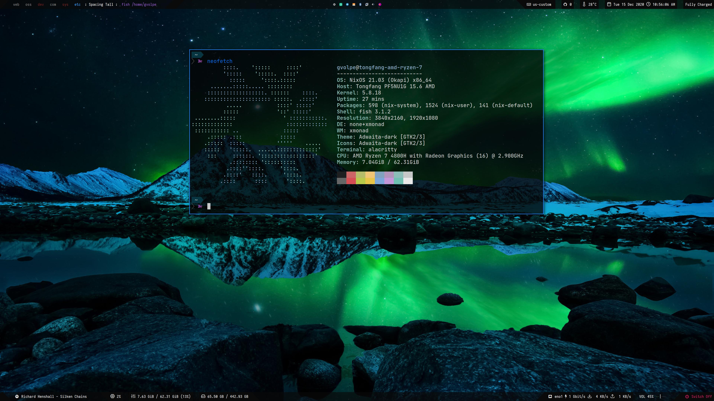

nix-config
==========

My current - and always evolving - NixOS configuration files, home-manager, neovim, etc.




## Programs

The `home.nix` file contains details about all the software I use but here's a shout-out to the ones I use the most and that are customized to my needs.

| Type           | Program      |
| :------------- | :----------: |
| Editor         | [NeoVim](https://neovim.io/) |
| Launcher       | [Rofi](https://github.com/davatorium/rofi) |
| Shell          | [Fish](https://fishshell.com/) |
| Status Bar     | [Polybar](https://polybar.github.io/) |
| Terminal       | [Alacritty](https://github.com/alacritty/alacritty) |
| Window Manager | [XMonad](https://xmonad.org/) |

I've also tried using `taffybar` for a while, configuration files still live in this repo. Here's a [screenshot](imgs/taffybar.png).

## Structure

Here is an overview of the folders' structure:

```
├── home
│   ├── display
│   ├── home.nix
│   ├── overlays
│   ├── programs
│   └── secrets
│   └── services
├── imgs
├── install.sh
├── notes
└── system
    ├── configuration.nix
    └── fonts
    └── machine
    └── wm
```

- `home`: all the user programs, services and dotfiles.
- `imgs`: screenshots and other images.
- `install.sh`: the install script.
- `notes`: cheat-sheets, docs, etc.
- `system`: the NixOS configuration, settings for different laptops and window managers.

## Install

On a fresh NixOS installation, run the following commands:

```shell
mkdir DELETE_ME && cd DELETE_ME
nix-shell --run \
  "wget -c https://github.com/gvolpe/nix-config/archive/master.tar.gz && tar --strip-components=1 -xvf master.tar.gz" \
  -p wget s-tar
chmod +x install.sh && ./install.sh
```

## Gnome3 (previous config)

I've been using Gnome3 for a while before switching to XMonad. Have a look at [Gnome3](./GNOME.md) for more.
