<div align="center">


# :space_invader: NixOS Config :space_invader:

[](https://gvolpe.com)
[](https://github.com/gvolpe/nix-config/actions/workflows/home.yml)
[](https://github.com/gvolpe/nix-config/actions/workflows/nixos.yml)
[](https://garnix.io)

My current — and always evolving — [NixOS](https://nixos.org/) and [Home Manager](https://github.com/nix-community/home-manager/) configurations.
</div>

## Niri

My current window manager — a scrollable-tiling Wayland compositor.

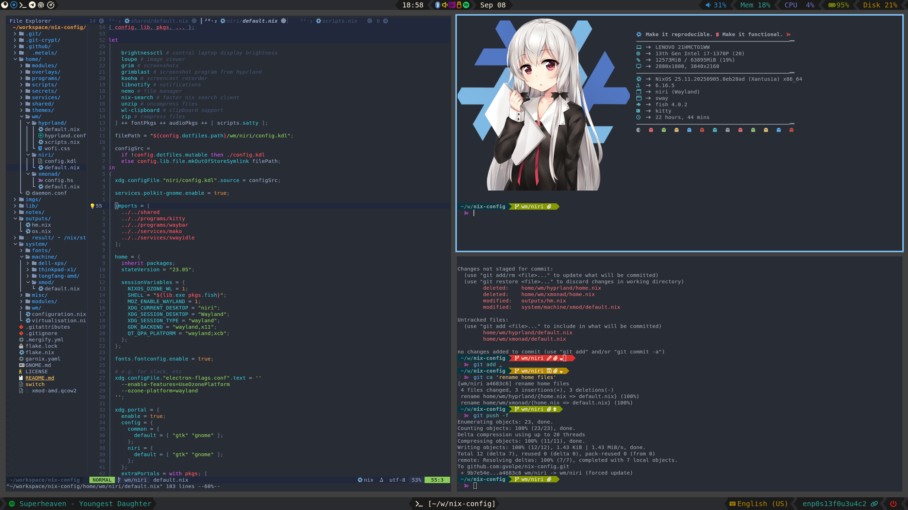

<details>
<summary>Environment details</summary>

| Type           | Program      |
| :------------- | :----------: |
| Editor         | [NeoVim](https://neovim.io/) |
| Launcher       | [Fuzzel](https://codeberg.org/dnkl/fuzzel) |
| Shell          | [Fish](https://fishshell.com/) |
| Status Bar     | [Waybar](https://github.com/Alexays/Waybar) |
| Terminal       | [Kitty](https://sw.kovidgoyal.net/kitty) |
| Window Manager | [Niri](https://github.com/YaLTeR/niri) |
| File Manager   | [Nemo](https://github.com/linuxmint/nemo) |
| Notifications  | [Sway NC](https://github.com/ErikReider/SwayNotificationCenter) |
| GTK Theme      | [Juno Ocean](https://github.com/EliverLara/Juno) |
| GTK Icon Theme | [Beauty Line](https://www.gnome-look.org/p/1425426/) |
| Terminal Font  | [JetBrainsMono](https://www.jetbrains.com/lp/mono/) |

</details>

<details>
<summary>Expand to see more screenshots</summary>


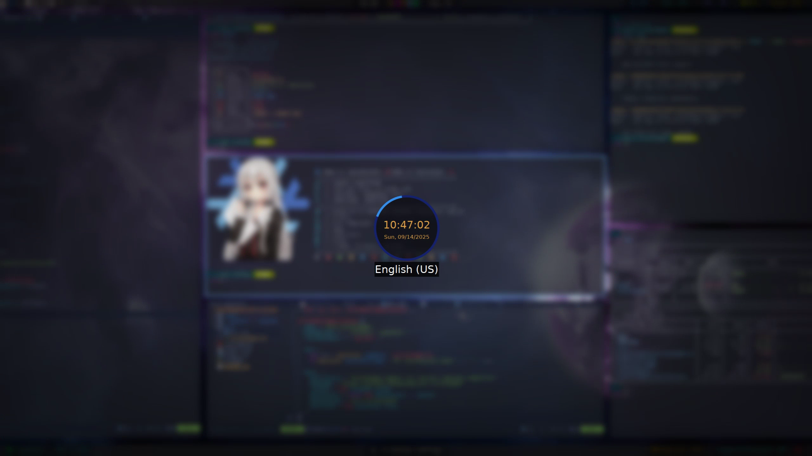

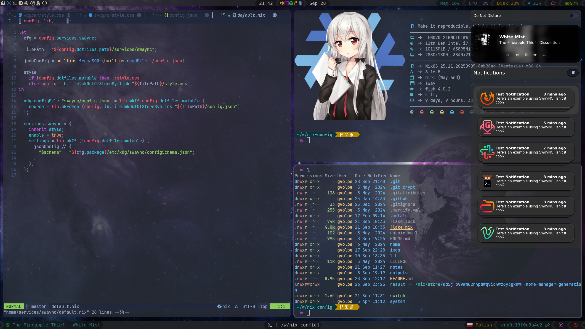

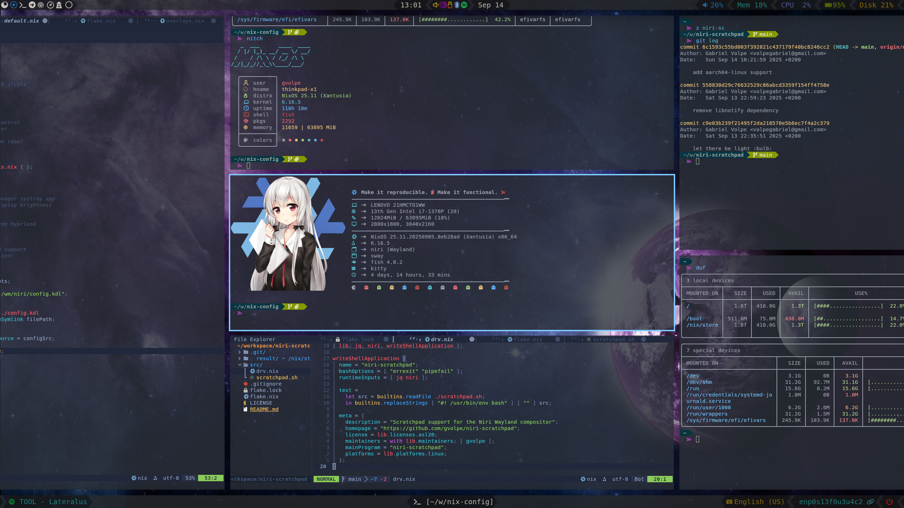

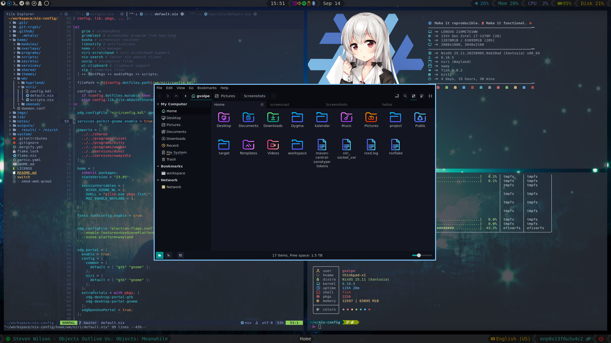

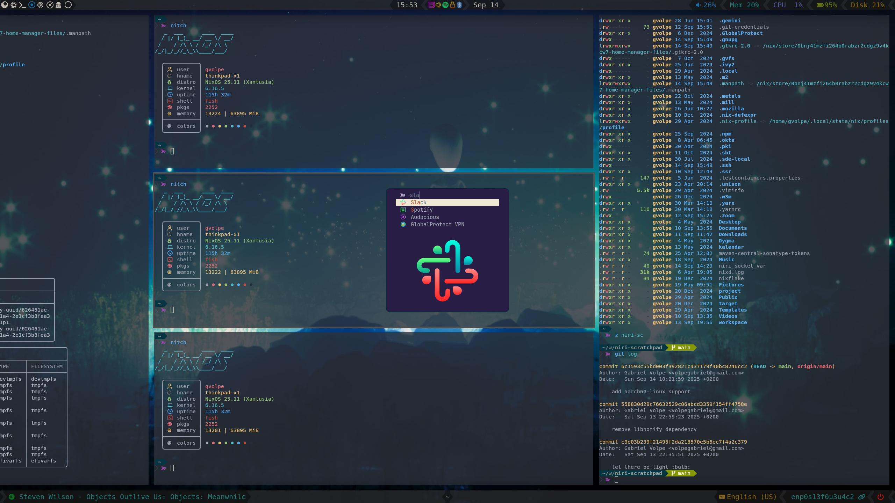

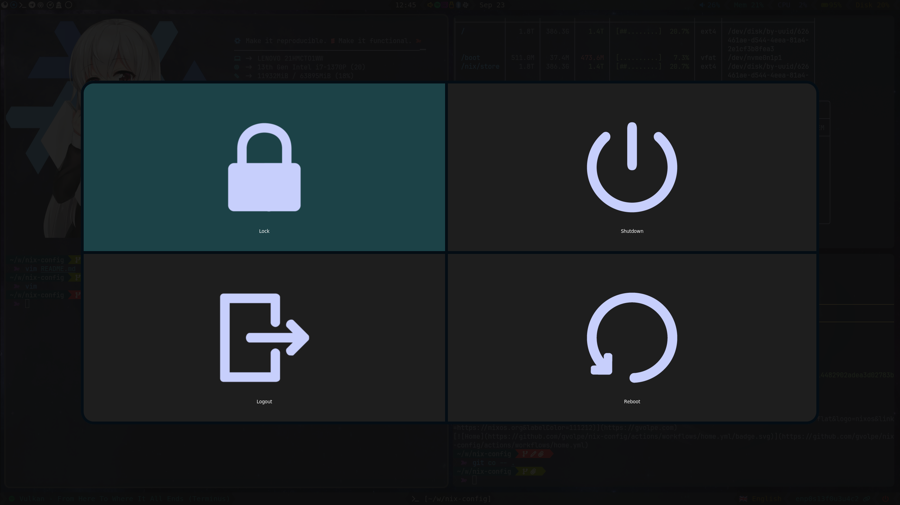

</details>

## Hyprland

My first Wayland compositor experience.

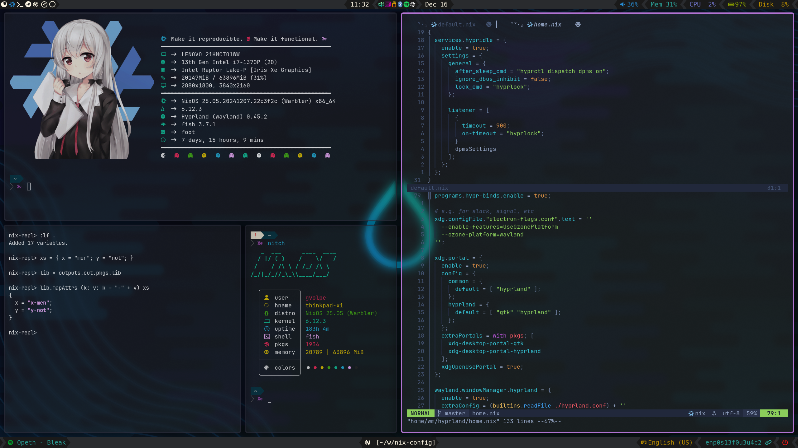

<details>
<summary>Environment details</summary>

| Type           | Program      |
| :------------- | :----------: |
| Editor         | [NeoVim](https://neovim.io/) |
| Launcher       | [Wofi](https://sr.ht/~scoopta/wofi) |
| Shell          | [Fish](https://fishshell.com/) |
| Status Bar     | [Waybar](https://github.com/Alexays/Waybar) |
| Terminal       | [Foot](https://codeberg.org/dnkl/foot) |
| Window Manager | [Hyprland](https://hyprland.org/) |
| File Manager   | [Nemo](https://github.com/linuxmint/nemo) |
| Notifications  | [Dunst](https://github.com/dunst-project/dunst) |
| GTK Theme      | [Juno Ocean](https://github.com/EliverLara/Juno) |
| GTK Icon Theme | [Beauty Line](https://www.gnome-look.org/p/1425426/) |
| Terminal Font  | [JetBrainsMono](https://www.jetbrains.com/lp/mono/) |

</details>

<details>
<summary>Expand to see more screenshots</summary>

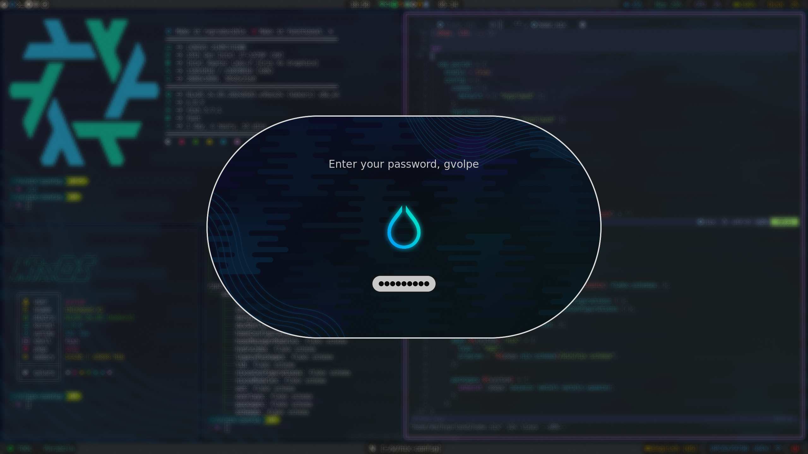

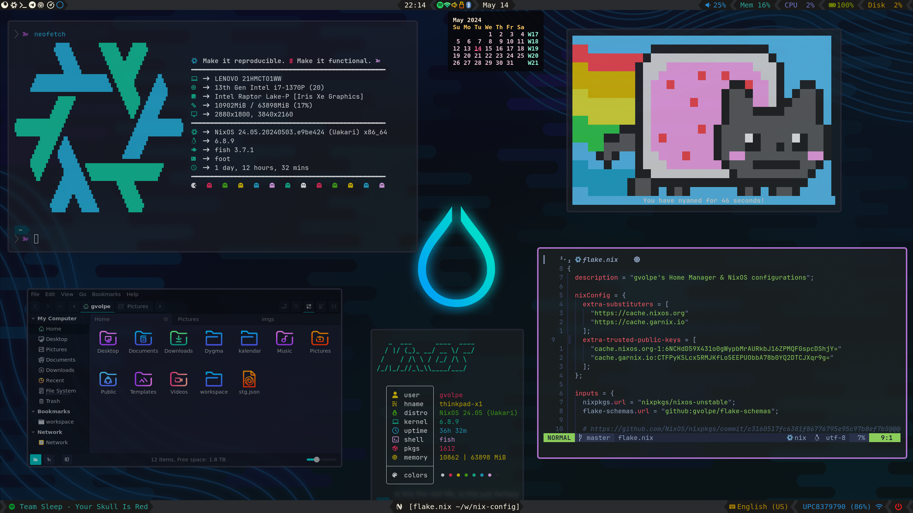

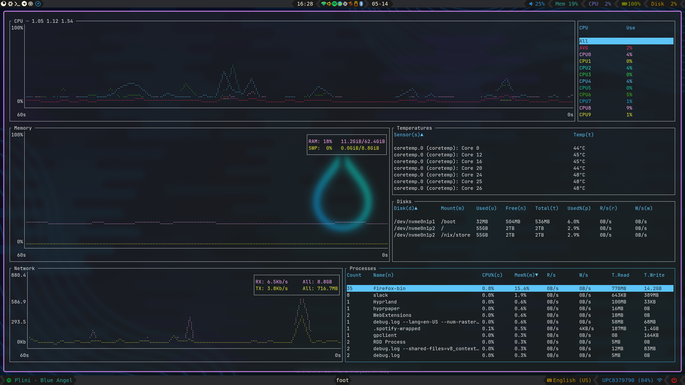

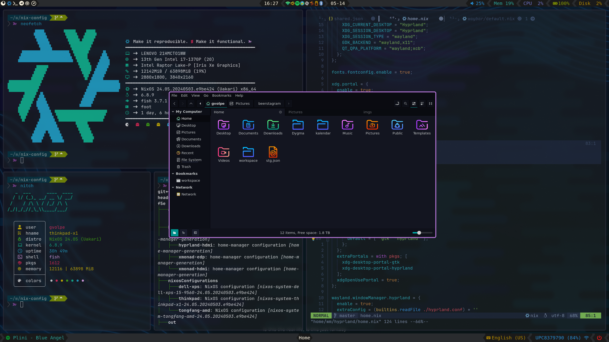

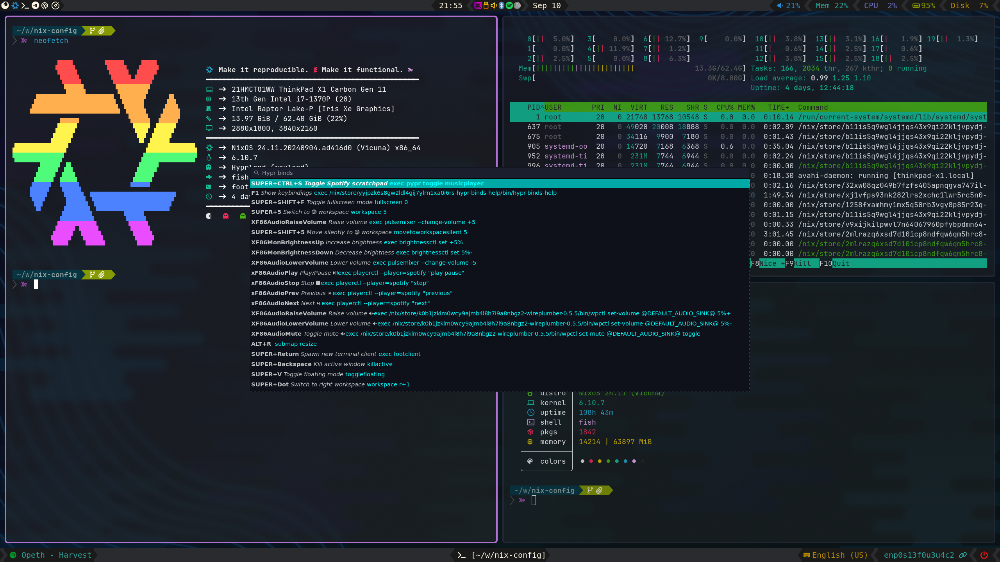

</details>

## XMonad

XMonad will be forever in my heart — the best X window manager!


<details>
<summary>Environment details</summary>

| Type           | Program      |
| :------------- | :----------: |
| Editor         | [NeoVim](https://neovim.io/) |
| Launcher       | [Rofi](https://github.com/davatorium/rofi) |
| Shell          | [Fish](https://fishshell.com/) |
| Status Bar     | [Polybar](https://polybar.github.io/) |
| Terminal       | [Alacritty](https://github.com/alacritty/alacritty) |
| Window Manager | [XMonad](https://xmonad.org/) |
| File Manager   | [Nautilus](https://gitlab.gnome.org/GNOME/nautilus) |
| Notifications  | [Dunst](https://github.com/dunst-project/dunst) |
| GTK Theme      | [Juno Ocean](https://github.com/EliverLara/Juno) |
| GTK Icon Theme | [Beauty Line](https://www.gnome-look.org/p/1425426/) |
| Terminal Font  | [JetBrainsMono](https://www.jetbrains.com/lp/mono/) |

</details>

<details>
<summary>Expand to see more screenshots</summary>


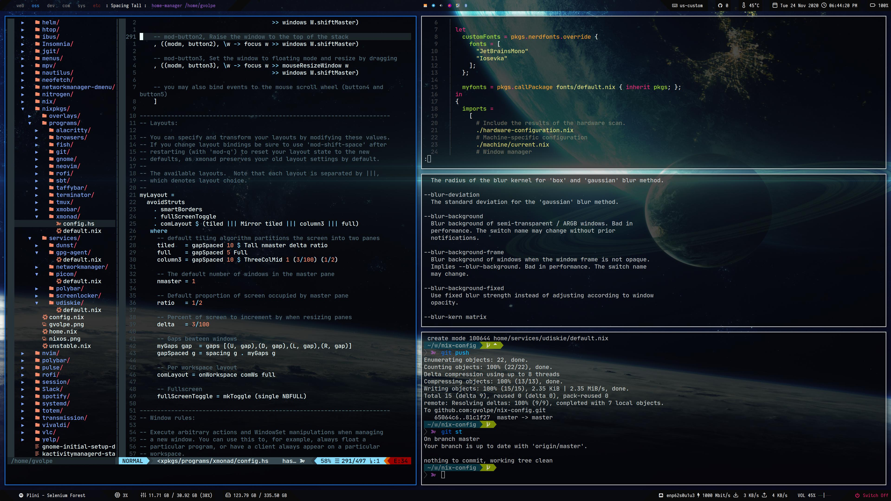

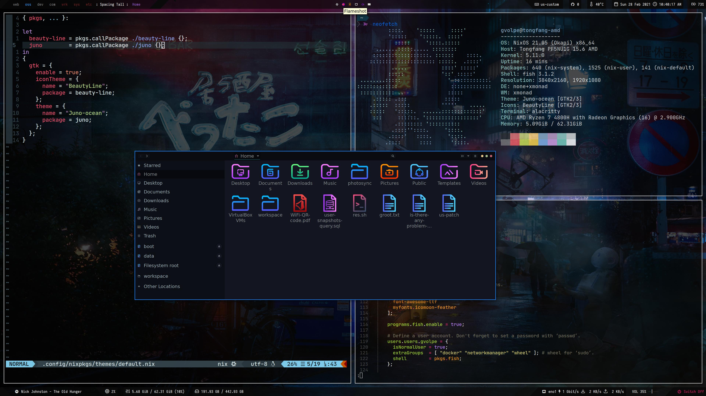


</details>

## NeoVim

My NeoVim configuration lives here: https://github.com/gvolpe/neovim-flake

## Structure

[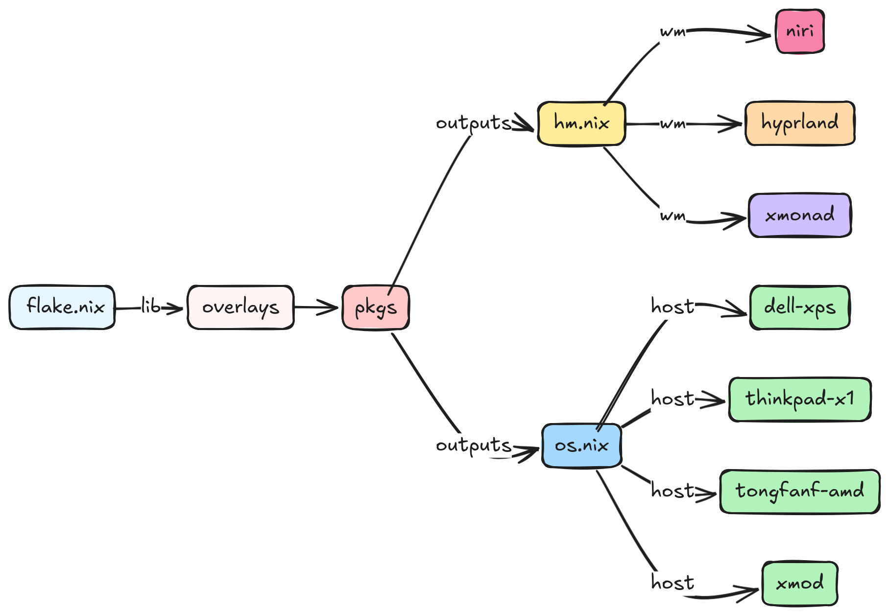](https://excalidraw.com/#json=HN_V0f2FpcX4YZPR-FKzO,MJR6ILT6va5BZ0r5Yo41Zw)

## Flake outputs

<details>
<summary>Expand to see available ouputs</summary>

```console
$ nix flake show github:gvolpe/nix-config
├───apps
│   └───x86_64-linux
│       └───nix: app
├───homeConfigurations
│   ├───hyprland-edp: Home Manager configuration [home-manager-generation]
│   ├───hyprland-hdmi: Home Manager configuration [home-manager-generation]
│   ├───hyprland-hdmi-mutable: Home Manager configuration [home-manager-generation]
│   ├───xmonad-edp: Home Manager configuration [home-manager-generation]
│   └───xmonad-hdmi: Home Manager configuration [home-manager-generation]
├───nixosConfigurations
│   ├───dell-xps: NixOS configuration [nixos-system-dell-xps-15-9560-24.11.20240620.d603719]
│   ├───thinkpad: NixOS configuration [nixos-system-thinkpad-x1-24.11.20240620.d603719]
│   ├───tongfang-amd: NixOS configuration [nixos-system-thinkpad-x1-24.11.20240620.d603719]
│   └───xmod: NixOS configuration [nixos-system-tongfang-amd-24.11.20240620.d603719]
├───out
│   ├───overlays: custom instance to be used by consumers of this flake
│   └───pkgs: custom instance to be used by consumers of this flake
└───packages
    └───x86_64-linux
        ├───bazecor: package [bazecor-1.5.4-patched]
        ├───metals: package [metals-1.4.1]
        ├───metals-updater: package [metals-updater-script]
        ├───neovim: package [neovim-0.10.2]
        ├───slack: package [slack-4.41.97]
        └───zoom-us: package [zoom-6.0.2.4680]
```

As well as all the declared flake inputs.

```console
nix flake metadata github:gvolpe/nix-config
```

</details>

<details>
<summary>Further installation instructions</summary>

### Install

The `xmod` configuration also contains my Home Manager configuration using the NixOS module, so it can easily be tested with a single command.

```console
nixos-rebuild switch --flake github:gvolpe/nix-config#xmod
```

Or you can test it directly on a QEMU virtual machine, though it has its limitations in terms of graphics.

```console
nixos-rebuild build-vm --flake github:gvolpe/nix-config#xmod
./result/bin/run-xmod-amd-vm
```

Having both NixOS and Home Manager configurations combined makes it easier to quickly install it on a new machine, but my preference is to have both separate, as my Home Manager configuration changes more often than that of the NixOS one, which can result in multiple (unwanted) generations at boot time.

Managing the different Home Manager generations in isolation makes this way easier for me.

### NixOS

The NixOS configuration can be installed by running the following command.

```console
nixos-rebuild switch --flake github:gvolpe/nix-config#thinkpad-x1
```

Beware that the `hardware-configuration.nix` file is the result of the hardware scan of the specific machine and might not be suitable for yours.

### Home Manager

A fresh install requires the creation of certain directories (see what the `switch` script does). However, if you omit those steps, the entire HM configuration can also be built as any other flake.

```console
nix build github:gvolpe/nix-config#homeConfigurations.xmonad-edp.activationPackage
result/activate
```

### Fresh install

To set up a new machine from scratch, have a look at [this document](./notes/new-machine.md).

</details>

## LICENSE

Licensed under the Apache License, Version 2.0 (the "License"); you may not use this project except in compliance with
the License. You may obtain a copy of the License at http://www.apache.org/licenses/LICENSE-2.0.

Unless required by applicable law or agreed to in writing, software distributed under the License is distributed on an
"AS IS" BASIS, WITHOUT WARRANTIES OR CONDITIONS OF ANY KIND, either express or implied. See the License for the specific
language governing permissions and limitations under the License.
